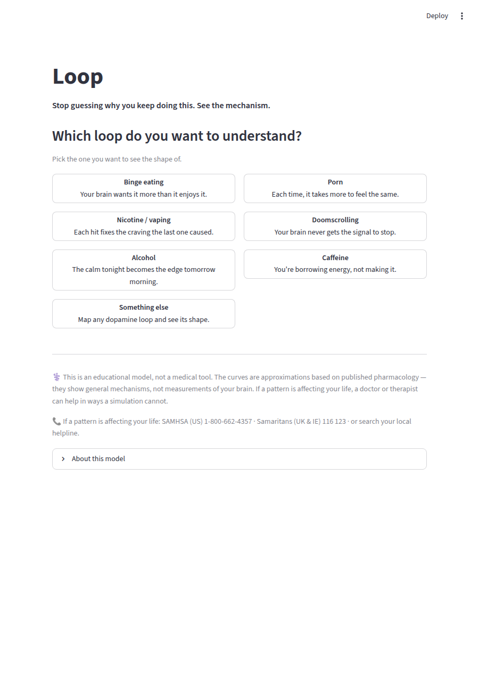
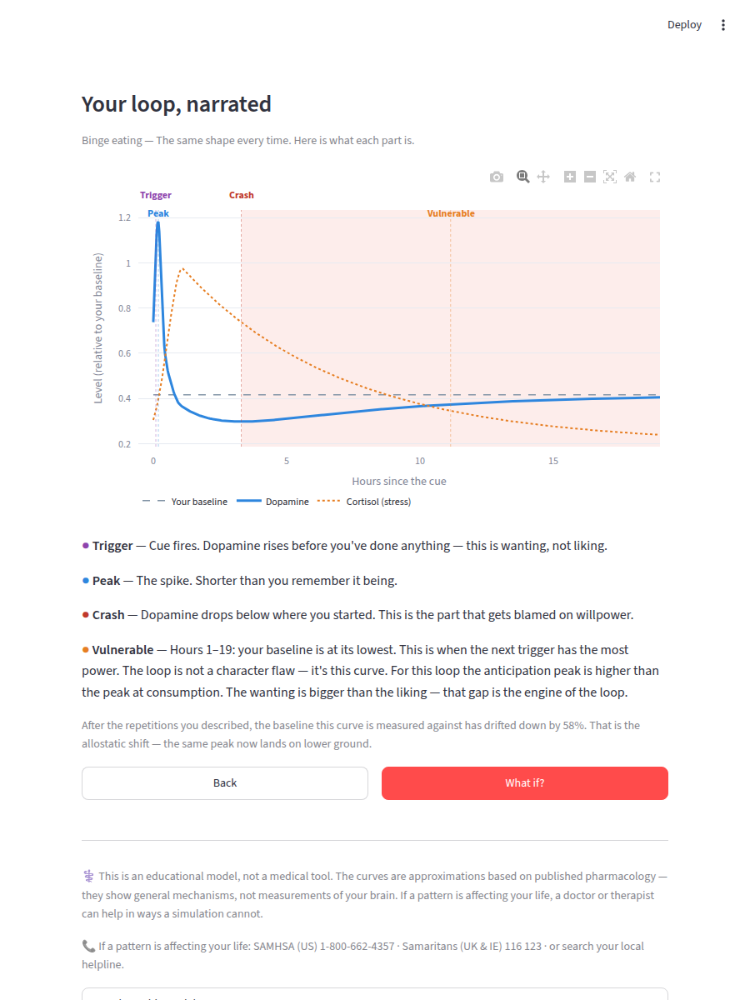

# Loop

**Stop guessing why you keep doing this. See the mechanism.**

Loop lets anyone map a dopamine-driven behavioural cycle — binge eating, porn,
nicotine, doomscrolling, alcohol, caffeine — and watch what the underlying
neurochemistry actually does over time. You pick a loop, answer three questions,
and get a personalised, narrated curve showing the four phases every loop shares:
the trigger, the peak, the crash **below** where you started, and the vulnerable
window when the next trigger has the most power.

The thesis is simple: **shame makes loops worse** (cortisol elevation lowers
prefrontal control and raises the odds of the next episode). So Loop never
lectures, scores, or moralises. It shows you the shape and explains the
mechanism — because "this is a neurochemical loop with a predictable shape" is a
very different thing to hear than "I have no self-control."





## Run it locally

```bash
pip install -r requirements.txt
streamlit run app.py
```

No PyTorch, no ML model, no database, no accounts. Just numpy + plotly behind a
continuous curve model, so it cold-starts in seconds and deploys anywhere.

## The four screens

1. **Pick your loop** — six presets plus a generic template. Every preset gets
   identical treatment; none is hidden or flagged.
2. **Make it yours** — frequency, how long the pattern has run (drives tolerance
   accumulation), and the pull on a bad day. Nothing is stored.
3. **Your loop, narrated** — dopamine, cortisol, and your drifted baseline on one
   timeline, with the four phases annotated in plain, mechanism-first language.
4. **What if?** — side-by-side curves: delay the episode, halve the frequency,
   and — the most motivating one — watch the baseline climb back over 30 days of
   no repetition.

## The science

Loop is a curve model grounded in three established ideas, not pop neuroscience:

- **Solomon & Corbit (1974), opponent-process theory of motivation.** Every fast
  affective response (the dopamine spike, the "a-process") triggers a slower,
  opposite response (the "b-process") that outlasts it and pulls you below
  baseline. That dip below baseline is the crash — and it is the whole point.
- **Koob & Le Moal (2001), the allostatic model of addiction.** With repetition
  the reward set-point drifts *downward*: you need more just to feel normal. This
  is the baseline-drift term, and why the "vulnerable" window deepens over time.
- **Berridge & Robinson, "wanting" vs. "liking".** Dopaminergic anticipation
  ("wanting") is dissociable from the opioid relief at consumption ("liking").
  For some loops — binge eating is the clearest — the anticipation peak is
  *higher* than the consumption peak. Wanting outruns liking. That gap drives the
  cycle.

The per-loop numbers are educational approximations grounded in published
pharmacology. **They are general mechanisms, not measurements of any individual
brain** — this is stated in the app and repeated here on purpose.

> This is an educational model, not a medical tool. If a pattern is affecting
> your life, a doctor or therapist can help in ways a simulation cannot.

## Project layout

```
loop/
├── app.py                # Streamlit entry point (four-screen flow)
├── loop/
│   ├── presets.py        # The six neurochemical profiles + generic template
│   ├── state.py          # BrainState (ACh/NE/DA + cortisol/opioid/baseline_drift)
│   ├── simulate.py       # Continuous opponent-process curve model
│   ├── narrate.py        # Phase detection + narration
│   └── copy.py           # Every static user-facing string (i18n-ready)
├── tests/                # Curve-property + tone-guard tests
└── requirements.txt      # streamlit, numpy, plotly — no torch
```

## Tests

```bash
pip install pytest
python -m pytest -q
```

The suite verifies each preset produces a peak above baseline, an undershoot
below baseline, and monotonic baseline erosion with repetition — and that no
shame/prescription/gamification language leaks into any user-facing string.

## Deploy (HuggingFace Spaces)

This README's YAML front-matter is a valid HF Spaces config. The Space runs as a
**Docker** Space (`sdk: docker`, port 8501 via the included `Dockerfile`) — HF's
API does not currently accept the `streamlit` SDK for this account, and Docker
runs the identical Streamlit app. To deploy to `umuutakarsu/loop`:

```bash
pip install -U huggingface_hub
python - <<'PY'
from huggingface_hub import HfApi
api = HfApi(token="<YOUR_WRITE_TOKEN>")
rid = f"{api.whoami()['name']}/loop"
api.create_repo(rid, repo_type="space", space_sdk="docker", exist_ok=True)
api.upload_folder(folder_path=".", repo_id=rid, repo_type="space",
                  ignore_patterns=[".git/*", "**/__pycache__/**"])
print("https://huggingface.co/spaces/" + rid)
PY
```

The image is a slim Python base with only numpy/plotly/streamlit (no torch), so
the Space builds and cold-starts quickly on the free tier.

## License

MIT — see [LICENSE](LICENSE).
